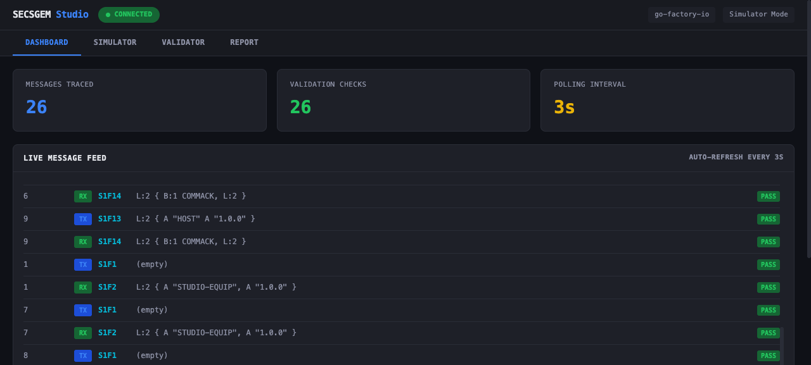
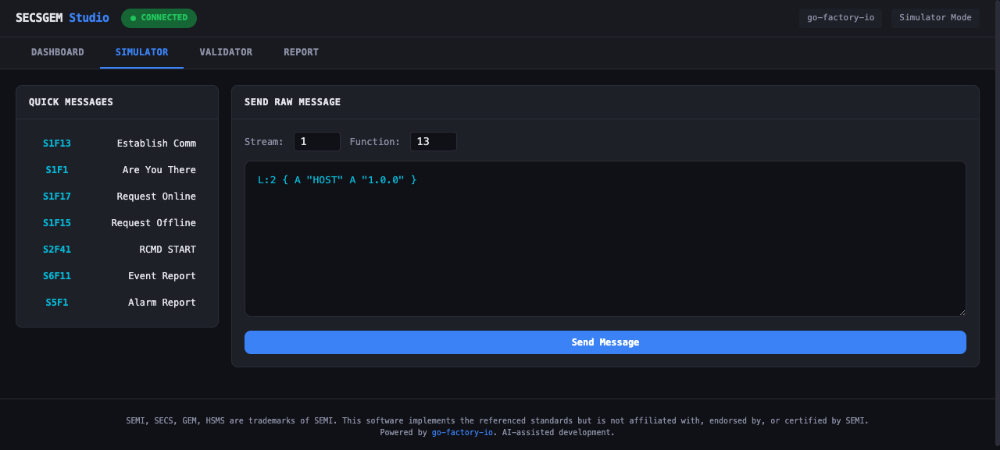
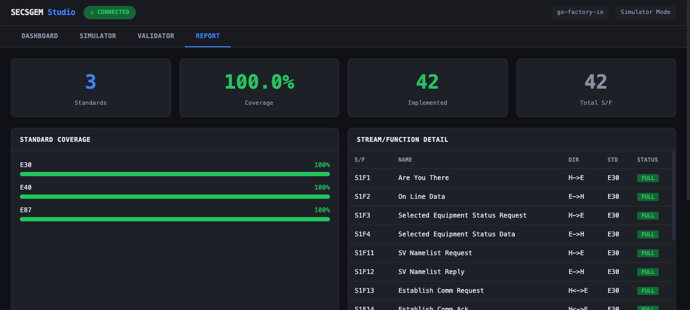

# go-factory-io

Open-source SECS/GEM equipment driver in Go. Covers 12 SEMI standards, 5 communication protocols, and a set of security controls modelled on IEC 62443 -- in a single static binary that runs on a Raspberry Pi.

This is an independent implementation, not certified or assessed against any SEMI or IEC standard. See [Security](#security) for what is enforced by default, what is opt-in, and what is an interface only.

**[SECSGEM Studio](https://studio.seikai.dev)** | **[Live Demo](https://factory.seikai.dev/tv/equipment)** | [API Docs](#rest-api) | [Go Library](#go-library-usage)

## Why this project exists

I started programming through the open-source community over twenty years ago, running a [phpBB forum](https://phpbb-tw.net/phpbb/), translating docs, fixing code, helping people. Building things and putting them on the internet for others to use felt natural then. It still does.

The SEMI SECS/GEM specs run over two thousand pages. Reading them is genuinely interesting -- how the state machines transition, how messages encode, the strict handshake protocol between equipment and host. Every layer has a reason behind its design. I enjoy digging into these systems and integrating across layers, so I decided to write a comprehensive Go implementation and see if it could be useful to the community.

The open-source ecosystem already has solid foundations. [secs4net](https://github.com/mkjeff/secs4net) (C#, 590+ stars) is battle-tested in .NET production environments. [secsgem](https://github.com/bparzella/secsgem) (Python) has a thorough GEM state machine. [secs4java8](https://github.com/kenta-shimizu/secs4java8) and [secs4go](https://github.com/younglifestyle/secs4go) provide stable transport layers in Java and Go respectively. These projects laid the groundwork for the entire ecosystem.

go-factory-io builds on top of that groundwork. It integrates the 300mm fab standards (E87 Carrier, E40 Process Job, E90 Substrate Tracking, E94 Control Job, E116 OEE), common factory protocols (OPC-UA, MQTT, Modbus TCP), and the increasingly important cybersecurity requirements (IEC 62443) into a single binary. I learned a lot reading secs4net and secsgem source code -- quite a few HSMS connection management patterns were absorbed from there.

### Coverage

```
  SEMI Standards & Protocols
  ────────────────────────────────────────
  Transport       E5 SECS-II Codec
                  E30 GEM State Machine
                  E37 HSMS (TLS/mTLS)

  300mm           E87  Carrier Management
                  E40  Process Jobs
                  E90  Substrate Tracking
                  E94  Control Jobs
                  E116 EPT / OEE

  Security        E187/E191 Cybersecurity controls
                  IEC 62443 aligned (uncertified)

  Multi-Protocol  OPC-UA, MQTT, Modbus TCP
                  REST, gRPC, SSE

  Observability   Prometheus metrics
```

### Acknowledgments

This project stands on the shoulders of the SECS/GEM open-source community. Reading their source code shaped many design decisions:

| Project | Language | What I learned |
|---------|----------|---------------|
| [secs4net](https://github.com/mkjeff/secs4net) | C# | HSMS connection management patterns, production edge-case handling |
| [secsgem](https://github.com/bparzella/secsgem) | Python | Thorough GEM state machine implementation structure |
| [secs4java8](https://github.com/kenta-shimizu/secs4java8) | Java | Dual-mode SECS-I + HSMS-GS architecture |
| [secs4go](https://github.com/younglifestyle/secs4go) | Go | Idiomatic Go patterns for SECS-II binary encoding |

go-factory-io extends the transport layer upward -- integrating carrier management, process tracking, equipment performance analytics, and industrial cybersecurity that 300mm fabs need. A different layer of the same problem space.

## SEMI Standards Coverage

| Standard | Description | Status |
|----------|-------------|--------|
| E5 | SECS-II Message Encoding | Full (14 types, 7M+ ops/sec) |
| E30 | GEM Equipment Model | Full (state machines, SV/EC, CE, alarm, RCMD) |
| E37 | HSMS Transport | Full (Active/Passive, T3-T8, TLS/mTLS) |
| E87 | Carrier Management | Full (FOUP lifecycle, 25-slot map, load port) |
| E40 | Process Job Management | Full (9-state lifecycle, recipe, abort/stop) |
| E90 | Substrate Tracking | Full (wafer location, movement history) |
| E94 | Control Job Management | Full (scheduling, pause/resume) |
| E116 | Equipment Performance Tracking | Full (OEE calculation, 11 states) |
| E187 | Fab Equipment Cybersecurity | Partial: RBAC and audit logging are on by default; TLS and the IP allowlist are opt-in per connection. Not assessed against the standard. |
| E191 | Cybersecurity Status Reporting | Partial: `/api/security/status` reports the tracker's own state, and only when one is attached. |

## SECSGEM Studio

Integrated simulator, validator, and protocol tracer with a built-in web UI.

**[Try it live](https://studio.seikai.dev)**

```bash
# Run locally with embedded web UI
./secsgem studio --host 127.0.0.1 --port 8080
# Open http://localhost:8080
```

A loopback-bound studio needs no token. Exposing it on a network interface without `--studio-token` leaves it running but read-only: the trace, validator and report tabs work, while the commands that drive the equipment (`send`, `quick_send`, `fault`, `run_script`) are refused. Set `SECSGEM_STUDIO_TOKEN` and open the UI as `/?token=<token>` to enable them.

Four tabs in one interface:

- **Dashboard** -- Real-time message feed with per-message validation badges
- **Simulator** -- Send standard GEM messages (S1F13, S1F1, S2F41...) or compose custom SML
- **Validator** -- Schema validation against E30/E87/E40, state transition compliance checking
- **Report** -- Implementation coverage across 3 standards and 42 S/F message types







The validator engine (`pkg/validator/`) and host simulator (`pkg/simulator/`) are also usable as Go libraries for CI integration and automated testing.

## Quick Start

```bash
# Build
go build -o secsgem ./cmd/secsgem/

# Run equipment simulator with REST API
./secsgem simulate

# In another terminal: query equipment
curl http://localhost:8080/api/status
curl http://localhost:8080/api/sv
curl http://localhost:8080/api/alarms

# Real-time event stream
curl -N http://localhost:8080/api/events
```

The simulator starts an HSMS equipment on `:5000` and a REST API on `:8080`. Connect as host:

```bash
./secsgem connect localhost:5000
```

Or launch SECSGEM Studio for a visual interface:

```bash
./secsgem studio --port 8080
```

## Architecture

```
                             go-factory-io
  ┌────────────────────────────────────────────────────────┐
  │                                                        │
  │  ┌─────────┐ ┌──────┐ ┌──────┐                        │
  │  │REST API │ │ gRPC │ │ MQTT │  Northbound             │
  │  │  + SSE  │ │      │ │Bridge│  (to MES/SCADA)         │
  │  └────┬────┘ └──┬───┘ └──┬───┘                         │
  │       └─────────┼────────┘                             │
  │            ┌────▼─────────────────────┐                │
  │            │       GEM Handler        │                │
  │            │  State Machine (E30)     │                │
  │            │  Variables (SV/EC)       │                │
  │            │  Events & Reports        │                │
  │            │  Alarms & Safety (S2)    │                │
  │            │  Remote Commands         │                │
  │            ├──────────────────────────┤                │
  │            │    300mm Extensions      │                │
  │            │  Carrier Mgmt (E87)      │                │
  │            │  Process Jobs (E40)      │                │
  │            │  Substrate Track (E90)   │                │
  │            │  Control Jobs (E94)      │                │
  │            │  EPT / OEE (E116)        │                │
  │            └────────┬─────────────────┘                │
  │            ┌────────▼────────┐                         │
  │            │  SECS-II Codec  │  Encode/Decode          │
  │            └────────┬────────┘                         │
  │       ┌─────────────┼──────────────┐                   │
  │  ┌────▼────┐  ┌─────▼─────┐ ┌─────▼─────┐             │
  │  │  HSMS   │  │  OPC-UA   │ │  Modbus   │ Southbound  │
  │  │TCP/TLS  │  │           │ │   TCP     │ (to equip)  │
  │  └────┬────┘  └─────┬─────┘ └─────┬─────┘             │
  └───────┼─────────────┼─────────────┼────────────────────┘
          │             │             │
     Equipment      OPC-UA        PLC/Sensor
     (SECS/GEM)     Server        (Modbus)
```

## Deployment

Single static binary. No runtime dependencies.

```bash
# Linux AMD64
CGO_ENABLED=0 GOOS=linux GOARCH=amd64 go build -ldflags="-s -w" -o secsgem ./cmd/secsgem/

# Raspberry Pi (ARM64) -- runs on 512MB RAM, <15MB resident
CGO_ENABLED=0 GOOS=linux GOARCH=arm64 go build -ldflags="-s -w" -o secsgem ./cmd/secsgem/

# Docker
docker build -t secsgem .
docker run -p 5000:5000 -p 8080:8080 secsgem
```

## REST API

| Method | Path | Description | Scope |
|--------|------|-------------|-------|
| GET | `/health` | Health check | public |
| GET | `/api/status` | Equipment state (comm, control, transport) | read |
| GET | `/api/sv` | List all Status Variables | read |
| GET | `/api/sv/{svid}` | Get a specific SV | read |
| GET | `/api/ec` | List all Equipment Constants | read |
| GET | `/api/ec/{ecid}` | Get a specific EC | read |
| PUT | `/api/ec/{ecid}` | Update an EC value | **write** |
| GET | `/api/alarms` | List all alarms | read |
| GET | `/api/alarms/active` | List active alarms | read |
| POST | `/api/command` | Execute a remote command (RCMD) | **write** |
| GET | `/api/events` | SSE stream for real-time events | read |
| GET | `/api/security/status` | SEMI E191 cybersecurity status | read |
| GET | `/metrics` | Prometheus metrics | public |

Authorization is `Authorization: Bearer <token>`. Read scope comes from `--api-token` (`SECSGEM_API_TOKEN`), write scope from `--api-write-token` (`SECSGEM_API_WRITE_TOKEN`); the write token also satisfies read. Without a write token the two write endpoints return 403 to every caller. A listener bound beyond loopback refuses to start without a read token.

All responses: `{ "success": true, "data": ... }` or `{ "success": false, "error": { "code": 400, "message": "..." } }`

## Go Library Usage

### Connect to Equipment

```go
cfg := hsms.DefaultConfig("192.168.1.100:5000", hsms.RoleActive, 1)
session := hsms.NewSession(cfg, logger)
session.Connect(ctx)
session.Select(ctx)

// Send S1F13 Establish Communication
body := secs2.NewList(secs2.NewASCII("HOST"), secs2.NewASCII("1.0.0"))
data, _ := secs2.Encode(body)
reply, _ := session.SendMessage(ctx, hsms.NewDataMessage(1, 1, 13, true, 0, data))
```

### Auto-Reconnect

```go
ms := session.NewManagedSession(cfg, session.DefaultReconnectConfig(), logger)
ms.OnConnect(func(s *hsms.Session) { logger.Info("Connected") })
ms.Start(ctx) // Reconnects automatically with exponential backoff
```

### Equipment Simulator

```go
eq := simulator.NewEquipment(simulator.DefaultEquipmentConfig(), logger)
eq.Start(ctx)

// Custom sensor
eq.Handler().Variables().DefineSVDynamic(2001, "SensorA", "mV", func() interface{} {
    return readSensor()
})

// Custom command
eq.Handler().Commands().Register("PP_SELECT", func(ctx context.Context, params []gem.CommandParam) gem.CommandStatus {
    return gem.CommandOK
})
```

### 300mm Carrier Management (E87)

```go
cm := handler.Carriers()
cm.DefinePort(1)
cm.SetPortInService(1)
cm.BindCarrier("FOUP-001", 1, "LOT-A", "PRODUCT")

// Full lifecycle
cm.ProceedWithCarrier("FOUP-001")
cm.StartAccess("FOUP-001")
cm.CompleteAccess("FOUP-001")
cm.ReadyToUnload("FOUP-001")
```

### Process Jobs (E40) & OEE (E116)

```go
// Create and run process job
pm := handler.ProcessJobs()
pm.Create("PJ-001", "RECIPE-A", "FOUP-001", []int{1,2,3}, nil)
pm.Setup("PJ-001")
pm.SetupComplete("PJ-001")
pm.Start("PJ-001")
pm.Complete("PJ-001")

// Track equipment performance
ept := handler.EPT()
ept.SetState(gem.EPTBusy)
ept.RecordUnit(false) // good unit
a, p, q, oee := ept.OEE()
```

## Multi-Protocol Support

### MQTT Bridge

Publishes GEM events to MQTT broker for MES/SCADA integration.

```bash
./secsgem simulate --mqtt-broker tcp://localhost:1883 --mqtt-prefix factory/eq01

# Subscribe from another terminal
mosquitto_sub -t "factory/eq01/#"
# factory/eq01/event/100  {"type":"collection_event",...}
# factory/eq01/alarm/1    {"type":"alarm","data":{"state":"set",...}}
```

Topics: `{prefix}/status`, `{prefix}/event/{ceid}`, `{prefix}/alarm/{alid}`, `{prefix}/sv/{svid}`

### gRPC API

```bash
./secsgem simulate --grpc-addr :50051
```

Proto at `api/grpc/proto/secsgem.proto`. 7 unary RPCs + 1 server-streaming (events).

### Modbus TCP

```go
client := modbus.NewClient(modbus.Config{Address: "192.168.1.100:502", UnitID: 1}, logger)
client.Connect(ctx)
regs, _ := client.ReadHoldingRegisters(ctx, 0, 10)
client.WriteSingleRegister(ctx, 100, 42)
```

FC01-FC06, FC15, FC16. Pure Go, no external dependencies.

### OPC-UA

```go
client := opcua.NewClient(opcua.Config{Endpoint: "opc.tcp://192.168.1.100:4840"}, logger)
client.Connect(ctx)
val, _ := client.Read(ctx, "ns=2;s=Temperature")
```

## Security

The controls below are modelled on IEC 62443 and SEMI E187/E191. Nothing here has been certified or independently assessed; the standard names describe the intent, not a conformance claim.

### On by default

| Control | Behaviour | Where |
|---------|-----------|-------|
| GEM access policy | `gem.NewHandler` starts on `security.MonitorPolicy`: reads and handshake only. S2F41 RCMD, S2F15 set EC, S1F15/S1F17, S2F33/35/37 and S5F3 are denied until you opt in. | `pkg/driver/gem/handler.go` |
| HSMS Select precondition | Data messages are rejected with Reject.req (entity not selected) unless the session is Selected. | `pkg/transport/hsms/session.go` |
| T7 not-selected timeout | A connection that never selects is dropped after T7 (default 10s). | `pkg/transport/hsms/session.go` |
| API authentication | A REST or gRPC listener bound beyond loopback refuses to start without `--api-token`. | `cmd/secsgem/main.go` |
| Read/write scope split | `PUT /api/ec/{ecid}` and `POST /api/command` need `--api-write-token`. A read token alone gets 403; with no write token they are closed entirely. | `api/rest/handler.go` |
| CORS | No `Access-Control-Allow-Origin` unless the request origin is on `--cors-origin`. There is no wildcard. | `api/rest/handler.go`, `pkg/studio/server.go` |
| Studio WebSocket origin | Same-origin only, widened solely by `--cors-origin`. | `pkg/studio/server.go` |
| Studio control commands | `send`, `quick_send`, `fault` and `run_script` require `--studio-token` unless the studio is bound to loopback. | `pkg/studio/server.go` |
| Message size and rate caps | 16MB message ceiling; per-connection rate limit when configured. | `pkg/transport/hsms/` |
| Output escaping | Device-supplied ASCII is escaped in the web UI and stripped of markup characters in the SML rendering. | `pkg/message/secs2/item.go`, `pkg/studio/web/studio.js` |

### Opt-in

| Control | How to enable |
|---------|---------------|
| TLS / mTLS on HSMS | Set `Config.TLSConfig`, or use `hsms.SecureConfig`. Plaintext otherwise. |
| Peer IP allowlist | Set `Config.AllowedPeers`. Accepts any peer otherwise. |
| Session TTL | Set `Config.SessionTTL`. Unlimited otherwise. |
| Full GEM access | `handler.SetPolicy(security.FullAccessPolicy())`, or `secsgem simulate --policy full`. |
| Security audit sink | `handler.SetAuditor(auditor)` plus `--webhook-url` or `--syslog-addr`. Events are logged locally otherwise. |
| E191 status reporting | `restServer.SetSecurityStatus(...)`. The endpoint reports "not configured" otherwise. |
| AES-256-GCM payload encryption | `pkg/security/encryption.go`. Not wired into any transport; call it from your own code. |
| Safety interlock | `handler.SetSafetyInterlock(...)`. |

### Interfaces only

These exist as Go interfaces with a software implementation for testing. They are not wired to real hardware or a real PKI, and the binary never calls them.

| Area | File |
|------|------|
| HSM / PKCS#11 key storage | `pkg/security/hsm.go` |
| CRL cache and OCSP checking | `pkg/security/revocation.go` |
| Anomaly detection | `pkg/security/anomaly.go` |

### Running it

```bash
# Local development: loopback bind, no token needed.
./secsgem studio --host 127.0.0.1 --port 8080
./secsgem simulate --api 127.0.0.1:8080

# Exposed: a token is mandatory, and writes need a second one.
export SECSGEM_API_TOKEN=$(openssl rand -hex 32)
export SECSGEM_API_WRITE_TOKEN=$(openssl rand -hex 32)
./secsgem simulate --api :8080 --cors-origin https://ui.example.com --policy full

# Studio exposed: without SECSGEM_STUDIO_TOKEN it still serves, read-only.
export SECSGEM_STUDIO_TOKEN=$(openssl rand -hex 32)
./secsgem studio --port 10000
# then open http://host:10000/?token=$SECSGEM_STUDIO_TOKEN
```

```go
// TLS plus an explicit GEM policy in library use.
tlsCfg, _ := security.LoadClientTLS("client.crt", "client.key", "ca.crt")
cfg := hsms.SecureConfig("equip:5000", hsms.RoleActive, 1, tlsCfg)

handler := gem.NewHandler(session, 1, "MDLN", "1.0.0", logger)
handler.SetPolicy(security.ReadOnlyPolicy()) // default is MonitorPolicy, stricter still
handler.SetAuditor(auditor)
```

### Known gaps

- The HSMS transport is plaintext unless you supply a TLS config; there is no certificate provisioning here.
- Bearer tokens are static and shared. There is no rotation, expiry, or per-user identity.
- The GEM policy governs SECS-II messages. The REST and gRPC surfaces are governed by the token scopes instead, so a write token can invoke a command the GEM monitor policy would refuse over HSMS.
- The Studio token can be passed as a query parameter because browsers cannot set headers on a WebSocket; that value may appear in proxy access logs.

## Project Structure

```
go-factory-io/
├── api/
│   ├── rest/              REST API + SSE + E191 endpoint
│   └── grpc/              gRPC server + proto
├── clients/python/        Async/sync Python client
├── cmd/secsgem/           CLI (simulate, connect, studio)
├── examples/simulator/    Equipment simulator
├── pkg/
│   ├── bridge/mqtt/       MQTT event bridge
│   ├── driver/gem/        GEM (E30) + 300mm extensions
│   ├── message/secs2/     SECS-II codec (7M+ ops/sec)
│   ├── metrics/           Prometheus collector
│   ├── security/          TLS, RBAC, AES-GCM, audit, HSM, anomaly
│   ├── session/           Auto-reconnect
│   ├── simulator/         Host simulator, fault injection, script runner
│   ├── studio/            Web UI server (go:embed)
│   ├── validator/         Schema, state, timing validation + coverage report
│   └── transport/
│       ├── hsms/          HSMS (E37)
│       ├── modbus/        Modbus TCP
│       └── opcua/         OPC-UA
├── studio-site/           Static site for studio.seikai.dev
└── test/integration/      E2E tests
```

## Testing

```bash
go test -race ./...          # All tests (70+)
go test -bench=. ./pkg/message/secs2/  # Benchmarks
go test -v ./test/integration/         # E2E with simulator
```

## Live Demo

- **[SECSGEM Studio](https://studio.seikai.dev)** -- Simulator, validator, and message tracer in the browser
- **[Showcase](https://factory.seikai.dev/showcase)** -- Interactive exhibit: architecture, live data, security layers
- **[Equipment Monitor](https://factory.seikai.dev/tv/equipment)** -- Real-time dashboard: OEE gauges, FOUP carriers, process job tracking

## Status

This is an educational and research project. The implementation follows published SEMI standard specifications and has been validated against a software simulator, not production semiconductor equipment. SEMI standard numbers (E5, E30, E37, etc.) are referenced for interoperability description purposes. The SEMI standards themselves are proprietary documents available from [SEMI.org](https://www.semi.org/).

If you plan to use this in a production environment, thorough validation against your specific equipment is required.

## License

MIT -- see [LICENSE](LICENSE)
